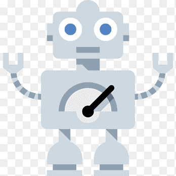

>

# Instagram Bot
spammer bot for instagram

# Note:
the bot on github may or may not work according to the current version of instagram .newer versions of the bot are not yet open sourced

# How does the bot work?

the bot uses sophisticated and complicated algorithms to find geniune user on instagram and drive them to a specified account or page which increases the reach and impressions of your page overall. hence indirectly increasing your following base.
in other words the bot works to advertise your account to potential followers
the bot will log in to your account everyday and will work for 18 hours nonstop.
the bot will first find potential users ,these users will be the users which have been interacting with similar pages to your niche so they have a higher chance of following you.
then the bot runs algorithms to decide what kind of interaction will be best for the user .interaction may include (liking the users post, commenting on their post and messaging them directly to follow you). this process runs every hour thus driving a huge amount of traffic to your account.

# How many impressions do I get per day after using this bot?

the bot will on average message 2 people per hour, like 10 posts of 7 users per hour, comment on 3 posts per hour 
that will be (2+7+3)* 18 hours -> i.e. 216 impressions atleast per day on average.this is the least number and atleast 216 people can be driven to your account in a span of a week through the bots one day of work.
(these variables vary, but these limits are applied to stop your account from getting banned from excess usage.)

# Is using bots illegal and can get you banned on instagram?

you may have probably heard about services which guarantee you a number of followers. never opt for them ,they are sure to get you banned. our bot on the other hand uses marketing techniques by humans and automates them  on targeted potential followers to increase your reach
## *main reasons for getting banned on instagram may include*
#### -liking too many posts in a small interval of time
#### -commenting the same things too many times frequently
#### -messaging too many new users frequently
#### -spending and surfing on instagram and viewing many profiles
#### -following/unfollowing too frequently
#### -getting too many temporary bans
#### -messaging a lot of new people per hour
#### -creating too many groups
#### -liking more than 2000 posts per day
#### -having more than 60 interactions per hour
#### -using abusive languages in your post and story
#### -logging in too many times
our bot takes care of all these limits ,imagine how tedious it will be to wait for every 30 seconds to interact with someone to avoid bans and still drive traffic to your account .with our bot you can sit back and see as the bot takes care of all this limits and drives huge traffic to your account everyday

# Is my password safe with the bot?

yes , the bot uses mongodb to store and retrive information about passwords and usera accounts ,this database is a remote database hence no person has a direct physical access to it ,your password is safe and secure with us and stored in encrypetd format
*do not provide passwords to anyone unless asked by the team to do so *

# Which plan should I use ? OR for How long should I use the bot?

## one day plan
if you want to try how this bot works this will be the best plan for you,although you should take a break of atleast 2 days before using this plan again
#### impressions -> ( 10 likes + 7 comments + 3 messages )* 17 hours == 340 impressions/ day == ATLEAST 340 users redirected to your page
#### cost(whichever is cheaper) -> 1 $ OR 60 Rs.

## three days plan
if you have already tried the bot and want to get efficient reach this will be the best plan for you,although you should take a break of atleast 3 days before using this plan again
#### impressions -> ( 9 likes + 4 comments + 3 messages )* 17 hours == 272 impressions/day == ATLEAST 816 users redirected to your page
#### cost(whichever is cheaper) -> 3 $ OR 200 Rs.

## ten days plan
if you trust our bot completely this is the best plan for you,although you should take a break of atleast 5 days using this plan again
#### impressions -> ( 7 likes + 2 comments + 2 messages )* 17 hours == 153 impressions/day == == ATLEAST 1530 users redirected to your page
#### cost(whichever is cheaper) -> 8 $ OR 500 Rs.

## twenty days custom plan
if you trust our bot completely and you have been a active user and if you feel that the limits given below are too less or too much according to you account you can change these limits with a customised plan , the number of accounts interacted per hour by the user will be selected by you,you can choose to run this plan from anywhere between 1 to 20 days
#### impressions -> ( X likes + X comments + X messages )* 17 hours == X impressions/day == == ATLEAST X users redirected to your page
#### cost(whichever is cheaper) -> ( the cost will be decided according to your plan )

# Rules while using the bot 

these rules are made to prevent your account from banning, as this bot will make your account more active on ig than it usually should be.
do not post more than 2 posts everyday, do not message more than 1 new person per day , do not reply to comments as long as bot is working ,do not spend more than an hour on the same account. DO not use the bot if you have less than 9 posts or if your account is less than a month old.
any voilation of these rules while the bot is working, will result in a temporary 2 day ban of commenting/ liking /posting of your account.
This bot works best for any account between 100 to 15K followers.

# How to buy?

just enter the form given below and our team will contact you
https://forms.gle/sB4HXVm6LeHkoUbc6

# Disclamer

Usage of this tool for attacking targets without prior mutual consent is illegal. It's the end user's responsibility to obey all applicable local, state and federal laws. Developers assume no liability and are not responsible for any misuse or damage caused by this program.

# Developer
@codewithnick
